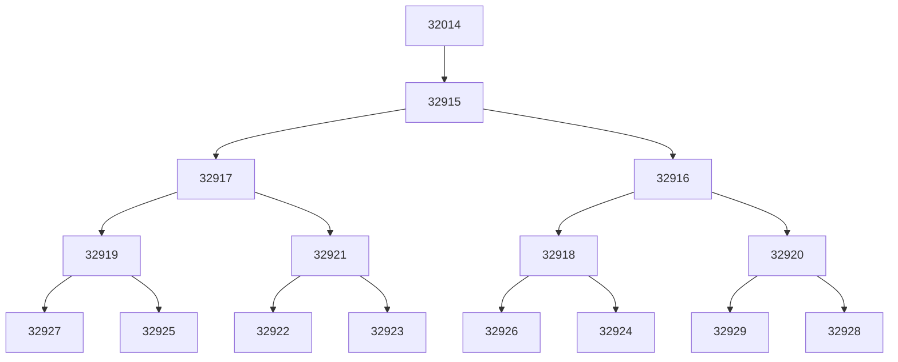

# Solución 1
La jerarquía de procesos generada del siguiente código se puede ver al final, el método `fork()` presente es el encargado de generar un proceso hijo como copia del padre para cada iteración dentro del bucle generado.

``` c
#include  <sys/types.h>
#include  <sys/wait.h>
#include  <unistd.h>
#include  <stdio.h>
#include  <stdlib.h>

#define L1 2
#define L2 3

int  main (int  argc, char *argv[]) {
int cont1, cont2;
pid_t pid;
for (cont2= 0; cont2< L2; cont2++) {
for (cont1= 0; cont1< L1; cont1++) {
pid= fork();
if (pid== 0) break;
}
if (pid!= 0) break;
}
printf ("PID proceso: %d ----> PID proceso padre %d .\n",getpid(), getppid());
if (pid!= 0)

for (cont1= 0; cont1< L1; cont1++)
printf ("Fin %d.\n", wait (NULL));
return  0;
}
```


## Jerarquía de procesos:

* Para su correcta visualización del arbol de procesos en vscode es necesario la extensión de mermaid en vscode `ext install bierner.markdown-mermaid` 
* Una solución web 


<!--stackedit_data:
eyJoaXN0b3J5IjpbLTE2NDk2NTI0NTQsMTY4NDk2ODQ4MCwxOT
QyNzE0NjYwXX0=
-->